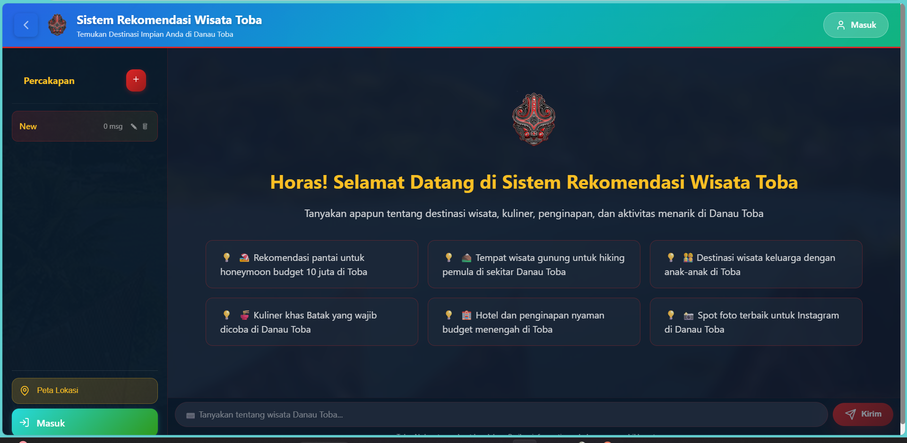

# 🏔️ Danau Toba Tourism Recommendation System

Chatbot berbasis **Hybrid CAG-RAG** for Danau Toba tourism recommendations. Sistem mengambil konteks dari dokumen PDF, menggunakan layered cache untuk mempercepat response, menyimpan riwayat percakapan per thread, mendukung feedback dan answer regeneration, serta dilengkapi user authentication, interactive map dengan user location, dan 3-Layer Hallucination Guard.

## 🖼️ Preview UI



---

## ✨ Features / Fitur

- 🤖 **RAG** — Document-grounded answers dari PDF wisata (FAISS + cosine similarity)
- ⚡ **CAG** — Staging cache → confirmed cache untuk fast and validated responses
- 🛡️ **3-Layer Hallucination Guard** — Retrieval threshold (0.30), staging cache, net-likes gate
- 🔄 **Auto-Regeneration** — Jawaban kurang baik bisa di-regenerate dan dibandingkan sebagai answer variants
- 🗺️ **Interactive Map** — Lokasi wisata dengan Leaflet + "Lokasi Saya" button (browser geolocation)
- 📏 **Sort by Distance** — Marker otomatis diurutkan dari lokasi user terdekat
- 👤 **Authentication** — Register/login email+password + Google OAuth
- 🎨 **Batak Theme UI** — Visual style terinspirasi budaya Batak
- 📊 **Comprehensive Evaluation** — Quantitative & Qualitative metrics
- 🔑 **Role-Based Access** — Role `admin`, `operator`, `user`

---

## 🛠️ Tech Stack

| Component | Technology |
|---|---|
| **LLM** | Gemini 2.5 Flash (GA) / 2.0 Flash / 1.5 Flash (Google Cloud Vertex AI) |
| **Embeddings** | `sentence-transformers/paraphrase-multilingual-MiniLM-L12-v2` |
| **Vector Store** | FAISS + BM25 hybrid retrieval (cosine similarity, threshold 0.30) |
| **Backend** | FastAPI + Uvicorn + SQLite |
| **Auth** | Session token (SHA-256+salt) + Google OAuth (Authlib) |
| **Frontend** | React 18 + Vite 5 + React Router v7 |
| **Maps** | Leaflet + React-Leaflet + OpenStreetMap (free, no API key) |
| **Geolocation** | Browser `navigator.geolocation` (free, no API key) |
| **Evaluation** | BERTScore, ROUGE, NLTK, scikit-learn |

---

## 📂 Project Structure / Struktur Project

```
├── database/
│   ├── avatars/               # User avatar uploads
│   ├── documents/             # PDF documents as RAG knowledge source
│   ├── FAQ/
│   │   └── faq_tourism.json   # FAQ dataset for cache pre-population
│   ├── kv_cache/
│   │   └── cache_index.json   # Confirmed + staging cache storage
│   └── Locations/
│       └── locations.json     # Tourism location data for map
├── frontend/
│   ├── public/                # Static assets (images, audio)
│   ├── src/
│   │   ├── App.jsx            # Main chat page, feedback, regeneration, map modal
│   │   ├── MapView.jsx        # Leaflet map component + geolocation
│   │   ├── components/
│   │   │   ├── AdminDashboard.jsx   # Admin panel
│   │   │   ├── Login.jsx            # Login/register page
│   │   │   ├── UserProfile.jsx      # User profile page
│   │   │   ├── AuthCallback.jsx     # Google OAuth callback
│   │   │   ├── ProtectedRoute.jsx   # Protected route guard
│   │   │   └── GuestRoute.jsx       # Guest-only route guard
│   │   ├── routes.jsx         # Public/auth/protected/admin route config
│   │   └── context/
│   │       └── AuthContext.jsx      # Global authentication state
│   ├── package.json
│   └── vite.config.js
├── logs/                      # Cache lifecycle logs
├── notebooks/
│   └── Evaluate.ipynb         # Full evaluation notebook
├── src/
│   ├── api.py                 # FastAPI - all API endpoints
│   ├── hybrid_system.py       # Orchestrator: Cache → FAQ → FAISS → LLM
│   ├── model.py               # Gemini REST API wrapper
│   ├── kv_cache_manager.py    # Staging + confirmed cache manager
│   ├── manage_cache.py        # Cache lifecycle (weekly cleanup/promotion)
│   ├── clear_invalid_cache.py # Utility to clean invalid cache entries
│   ├── decision_agent.py      # User preference extraction from query
│   ├── database.py            # SQLite: users, sessions, chat history
│   ├── evaluation.py          # Evaluation metrics (BERTScore, ROUGE, etc.)
│   └── faq_generator.py       # FAQ generator and manager
├── requirements.txt
├── service-account.json       # Google Cloud Vertex AI credentials
├── setup_app.sh               # App deployment setup script
└── setup_vps.sh               # VPS environment setup script
```

---

## 🚀 Installation & Run Guide (from scratch)

### Prerequisites / Prasyarat

Pastikan tools berikut sudah terinstal:

| Software | Versi Minimum | Download |
|---|---|---|
| **Python** | 3.10+ | https://www.python.org/downloads/ |
| **Node.js** | 18+ (termasuk npm) | https://nodejs.org/ |
| **Git** | (opsional) | https://git-scm.com/ |

> Verify installation: `python --version` and `node --version`

---

### Step 1 - Clone / Extract Project

```bash
# If using Git
git clone <url-repo>
cd Implementasi

# Or extract ZIP and enter project folder
cd Implementasi
```

---

### Step 2 - Create Python Virtual Environment

```bash
# Create virtual environment
python -m venv .venv

# Activate (Windows)
.venv\Scripts\activate

# Activate (Linux / macOS)
source .venv/bin/activate
```

> After activation, terminal prompt biasanya berubah menjadi `(.venv) ...`

---

### Step 3 - Install Python Dependencies

```bash
pip install -r requirements.txt
```

> This will install backend libraries: FastAPI, LangChain, FAISS, sentence-transformers, Gemini client, dll. Proses bisa memakan beberapa menit.

---

### Step 4 - Create `.env` File & Service Account

1. Buat Service Account di Google Cloud Console dengan role **Vertex AI User**.
2. Download file JSON credentials, ubah namanya menjadi `service-account.json`, dan simpan di folder project root.
3. Create `.env` file di **project root**:

```env
# ── REQUIRED / WAJIB: Google Cloud Vertex AI ───────────────────────────────
GOOGLE_APPLICATION_CREDENTIALS=./service-account.json
GOOGLE_CLOUD_PROJECT=chatbot-toba
VERTEX_LOCATION=us-central1

# Random long secret for session encryption (jangan dipublish)
SECRET_KEY=ganti-dengan-string-acak-yang-panjang-dan-aman

# ── OPTIONAL: Google OAuth (login with Google account) ─────────────────────
# If not set, "Login with Google" will be disabled
# but email+password login tetap bisa digunakan
# GOOGLE_CLIENT_ID=your_google_client_id
# GOOGLE_CLIENT_SECRET=your_google_client_secret
# GOOGLE_REDIRECT_URI=http://localhost:8000/api/auth/google/callback
# FRONTEND_URL=http://localhost:3000
```

> ⚠️ Never commit `.env` and `service-account.json` to Git. File ini sudah masuk `.gitignore`.

---

### Step 5 - Install Frontend Dependencies

```bash
cd frontend
npm install
```

> This installs React, Vite, Leaflet, dll. ke folder `frontend/node_modules/`.

---

### Step 6 - Run the System

You need **two terminals** running in parallel.

**Terminal 1 - Backend (FastAPI):**
```bash
# From project root with active .venv
python src/api.py
```

Wait until output appears like:
```
✅ Model initialized
✅ Embedding model loaded
📄 Loading documents...
🚀 Server started at http://0.0.0.0:8000
```

**Terminal 2 - Frontend (React + Vite):**
```bash
cd frontend
npm run dev
```

Wait until output appears like:
```
  VITE v5.x.x  ready in ...ms
  ➜  Local:   http://localhost:3000/
```

---

### Step 7 - Open in Browser

| Access | URL |
|---|---|
| 🌐 App | http://localhost:3000 |
| 🔌 API | http://localhost:8000 |
| 📚 Swagger Docs | http://localhost:8000/docs |

> **Default admin account** (created automatically on first run):
> - Username: `admin`
> - Password: `admin123`
> - ⚠️ Segera ganti password setelah first login.

---

## 🗺️ Map & Geolocation Features

Klik tombol **Peta Lokasi** di sidebar and map modal will open:

- **Red markers** - tourism points from `database/Locations/locations.json`
- **"📍 Lokasi Saya" button** - detect your position via browser GPS (free, no API key)
- **Blue marker** - your current location
- **Distance in popup** - each marker shows distance from your position (km)
- **Nearest-first sorting** - marker list otomatis diurutkan dari yang terdekat

> Browser akan meminta location permission. Klik "Izinkan" / "Allow".   

---

## 📡 API Endpoints

### Chat & System
| Endpoint | Method | Function |
|---|---|---|
| `/api/chat` | POST | Send question to chatbot |
| `/api/chat/regenerate` | POST | Regenerate answer for the same question |
| `/api/chat/choose-variant` | POST | Choose original or regenerated answer |
| `/api/status` | GET | System and model status |
| `/api/stats` | GET | Cache statistics |
| `/api/locations` | GET | Tourism location data |
| `/api/feedback` | POST | Submit like/dislike feedback |
| `/api/feedback/stats` | GET | Feedback statistics |

### Authentication / Autentikasi
| Endpoint | Method | Function |
|---|---|---|
| `/api/auth/register` | POST | Register new account |
| `/api/auth/login` | POST | Login with email + password |
| `/api/auth/logout` | POST | Logout |
| `/api/auth/me` | GET | Get active user profile |
| `/api/auth/validate` | GET | Validate session token |
| `/api/auth/google/login` | GET | Redirect to Google OAuth |
| `/api/auth/google/callback` | GET | Google OAuth callback |

### User Profile / Profil Pengguna
| Endpoint | Method | Function |
|---|---|---|
| `/api/user/profile` | PUT | Update user profile |
| `/api/user/change-password` | POST | Change password |
| `/api/user/history` | GET | Get chat history |
| `/api/user/history` | DELETE | Delete chat history |
| `/api/user/avatar/upload` | POST | Upload avatar image |
| `/api/user/avatar/base64` | POST | Update avatar via emoji/base64 |
| `/api/conversations` | GET | List conversation threads |
| `/api/conversations/{conversation_id}/history` | GET | Get conversation history |

### Admin (Role `admin`)
| Endpoint | Method | Function |
|---|---|---|
| `/api/admin/users` | GET | List all users |
| `/api/admin/stats` | GET | System statistics |
| `/api/admin/analytics` | GET | Admin analytics |
| `/api/admin/user/{id}` | DELETE | Deactivate user |
| `/api/admin/cache/lifecycle` | GET | Preview cache lifecycle |
| `/api/admin/cache/lifecycle/execute` | POST | Execute cache lifecycle |
| `/api/admin/cache/prepopulate` | POST | Pre-populate cache from FAQ |
| `/api/admin/cache/kv/wipe` | DELETE | Wipe all KV cache entries |

### Cache
| Endpoint | Method | Function |
|---|---|---|
| `/api/clear` | POST | Clear cache |
| `/api/optimize` | POST | Optimize cache |

---

## 👤 Authentication System / Sistem Autentikasi

### Email + Password
- Password di-hash menggunakan SHA-256 + salt sebelum disimpan
- Login menghasilkan **session token** yang disimpan di SQLite
- Token dikirim sebagai `Authorization: Bearer <token>` pada setiap request

### Google OAuth
- Login via Google akan menyimpan `email` dan `name` dari akun Google
- Jika email sudah terdaftar, account akan otomatis terhubung

### Role
| Role | Access |
|---|---|
| `user` | Chat, profile, history |
| `operator` | + cache management |
| `admin` | + all admin endpoints |

---

## ⚡ Cache System (CAG)

Response pipeline berjalan dalam urutan berikut:

```
User Query
    │
    ▼
[1] KV Cache (confirmed) ──── HIT ──▶ Return cached response directly
    │ MISS
    ▼
[2] FAQ Search ─────────────── MATCH ▶ Return answer + save to staging cache
    │ NO MATCH
    ▼
[3] FAISS + BM25 Retrieval (RAG) ─ score ≥ 0.30 ──▶ Send context to Gemini
    │ score < 0.30
    ▼
[4] Gemini (without context) ──▶ General answer
    │
    ▼
Response → Staging Cache → (after positive signal) → Confirmed Cache
```

### Cache Lifecycle
Dijalankan mingguan via `manage_cache.py`:
- **Delete**: access < 5 kali AND age > 21 days
- **Promote to FAQ**: access ≥ 5 kali AND net-likes ≥ 1
- **Delete low quality**: access ≥ 5 kali AND net-likes < 0

### Conversation Flow / Alur Percakapan
- Setiap chat disimpan sebagai conversation thread, sehingga sidebar bisa menampilkan history per topik.
- Follow-up query dengan kata seperti "nya" atau "itu" akan di-ground ke tempat terakhir yang dibahas.
- Jika jawaban cache dianggap kurang baik, user bisa dislike lalu memilih hasil regeneration yang lebih sesuai.

---

## 📊 Evaluation / Evaluasi

```bash
# Run full evaluation notebook
jupyter notebook notebooks/Evaluate.ipynb
```

**Evaluated metrics:**
1. **Efficiency**: Response Time, Cache Hit Rate (CHR)
2. **Retrieval**: RAG Recall, Effective Information Rate (EIR)
3. **Generation**: BERTScore (P/R/F1), Completeness, Hallucination Rate, Irrelevancy Score
4. **Qualitative**: Relevance, Accuracy, Completeness, Clarity, Usefulness

---

## 🧹 Utilities / Utilitas

```bash
# Clean invalid/corrupted cache
python src/clear_invalid_cache.py

# Preview cache lifecycle (dry-run, no changes)
python src/manage_cache.py

# Execute cache lifecycle (deletion & promotion)
python src/manage_cache.py --execute
```

---

## ❓ Troubleshooting

| Problem | Solution |
|---|---|
| `ModuleNotFoundError` | Pastikan virtual environment aktif dan jalankan `pip install -r requirements.txt` |
| `DefaultCredentialsError` atau Error 401 | Ensure `service-account.json` exists in project root and `.env` has `GOOGLE_APPLICATION_CREDENTIALS=./service-account.json` |
| Backend not starting | Check if port 8000 is already in use: `netstat -ano \| findstr :8000` |
| Frontend cannot connect to backend | Pastikan backend berjalan di port 8000 sebelum menjalankan frontend |
| Geolocation not working | Allow location permission in browser; HTTP non-localhost biasanya dibatasi |
| `npm: command not found` | Install Node.js from https://nodejs.org/ |

---

## 👨‍💻 Author

**TASI-104** — Institut Teknologi Del

---

MIT License © 2025

update di vps:

bash ~/llm-chatbot-RAG-CAG/deploy.sh